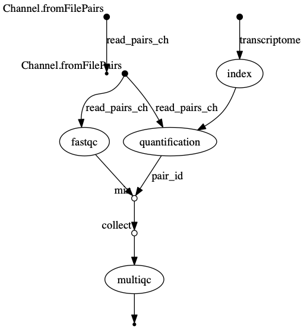

::::::::::::::::::::::::::::::::::::::: objectives

- Create a simple RNA-Seq pipeline.
- Use the `log.info` function to print all the pipeline parameters.
- Print a confirmation message when the pipeline completes.
- Use a conda `environment.yml` file to install the pipeline's software requirement.
- Produce an execution report and generates run metrics from a pipeline run.

::::::::::::::::::::::::::::::::::::::::::::::::::

:::::::::::::::::::::::::::::::::::::::: questions

- How can I create a Nextflow pipeline from a series of unix commands and input data?
- How do I log my pipelines parameters?
- How can I manage my pipeline software requirement?
- How do I know when my pipeline has finished?
- How do I see how much resources my pipeline has used?

::::::::::::::::::::::::::::::::::::::::::::::::::

We are finally ready to implement a simple RNA-Seq pipeline in Nextflow.
This pipeline will have 4 processes that:

- Indexes a transcriptome file.

```bash
$ salmon index --threads $task.cpus -t $transcriptome -i index
```

- Performs quality controls

```bash
$ mkdir fastqc_<sample_id>_logs
$ fastqc -o fastqc_<sample_id>_logs -f fastq -q <reads>
```

- Performs transcript level quantification.

```bash
$ salmon quant --threads <cpus> --libType=U -i <index> -1 <read1> -2 <read2> -o <pair_id>
```

- Create a MultiqQC report form the FastQC and salmon results.

```bash
$ multiqc .
```

To start move to `scripts/rnaseq_pipeline` folder.

```bash
$ cd scripts/rnaseq_pipeline
```

This folder contains files we will be modifying in this episode.

We will also create a symbolic link to the data directory.

```bash
$ ln -s ../../data data
```

## Define the pipeline parameters

The first thing we want to do when writing a pipeline is define the pipeline parameters.
The script `script1.nf` defines the pipeline input parameters.

```groovy 
//script1.nf
params.reads = "data/yeast/reads/*_{1,2}.fq.gz"
params.transcriptome = "data/yeast/transcriptome/*.fa.gz"


println "reads: $params.reads"
```

Run it by using the following command:

```
$ nextflow run script1.nf
```

{: language-bash}

We can specify a different input parameter using the `--<params>` option, for example :

```groovy 
$ nextflow run script1.nf --reads "data/yeast/reads/ref1*_{1,2}.fq.gz"
```

```output 
reads: data/yeast/reads/ref1*_{1,2}.fq.gz
```

:::::::::::::::::::::::::::::::::::::::  challenge

## Add a parameter

Modify the `script1.nf` adding a third parameter named `outdir` and set it to `results`. This parameter will be used as the pipeline output directory.

:::::::::::::::  solution

## Solution

```groovy 
params.outdir = "results"
```

:::::::::::::::::::::::::

::::::::::::::::::::::::::::::::::::::::::::::::::

It can be useful to print the pipeline parameters to the screen. This can be done using the the `log.info` command and a multiline string statement. The string method `.stripIndent()` command is used to remove the indentation on multi-line strings. `log.info` also saves the output to the log execution file `.nextflow.log`.

```groovy 
log.info """\
         transcriptome: ${params.transcriptome}
         """
         .stripIndent()
```

:::::::::::::::::::::::::::::::::::::::  challenge

## log.info

Modify the `script1.nf` to print all the pipeline parameters by using a single `log.info` command and a multiline string statement.
See an example [here](https://github.com/nextflow-io/rnaseq-nf/blob/3b5b49f/main.nf#L41-L48).

```bash 
$ nextflow run script1.nf
```

Look at the output log `.nextflow.log`.

:::::::::::::::  solution

## Solution

Below is an example log.info command printing all the pipeline parameters.

```groovy 
log.info """\
        R N A S E Q - N F   P I P E L I N E    
        ===================================
        transcriptome: ${params.transcriptome}
        reads        : ${params.reads}
        outdir       : ${params.outdir}
        """
        .stripIndent()
```

```bash 
$ less .nextflow.log
```

:::::::::::::::::::::::::

::::::::::::::::::::::::::::::::::::::::::::::::::

### Recap

In this step you have learned:

- How to define parameters in your pipeline script.

- How to pass parameters by using the command line.

- The use of `$var` and `${var}` variable placeholders.

- How to use multiline strings.

- How to use `log.info` to print information and save it in the log execution file.

## Create a transcriptome index file

Nextflow allows the execution of any command or user script by using a `process` definition.

For example,

```bash
$ salmon index --threads $task.cpus -t $transcriptome -i index
```

A process is defined by providing three main declarations:

1. The process [inputs](https://www.nextflow.io/docs/latest/process.html#inputs),
2. The process [outputs](https://www.nextflow.io/docs/latest/process.html#outputs)
3. Finally the command [script](https://www.nextflow.io/docs/latest/process.html#script).

The second example, `script2.nf` adds,

1. The  process `INDEX` which generate a directory with the index of the transcriptome. This process takes one input, a transcriptome file, and emits one output a salmon index directory.
2. A queue Channel `transcriptome_ch` taking the  transcriptome file defined in params variable `params.transcriptome`.
3. Finally the script adds a `workflow` definition block which calls the `INDEX` process using the Channel `transcriptome_ch` as input.

```groovy 
//script2.nf
nextflow.enable.dsl=2

/*
 * pipeline input parameters
 */
params.reads = "data/yeast/reads/*_{1,2}.fq.gz"
params.transcriptome = "data/yeast/transcriptome/Saccharomyces_cerevisiae.R64-1-1.cdna.all.fa.gz"
params.outdir = "results"

println """\
         R N A S E Q - N F   P I P E L I N E
         ===================================
         transcriptome: ${params.transcriptome}
         reads        : ${params.reads}
         outdir       : ${params.outdir}
         """
         .stripIndent()


/*
 * define the `INDEX` process that create a binary index
 * given the transcriptome file
 */
process INDEX {

    input:
    path transcriptome

    output:
    path 'index'

    script:
    """
    salmon index --threads $task.cpus -t $transcriptome -i index
    """
}

transcriptome_ch = channel.fromPath(params.transcriptome)

workflow {
   INDEX(transcriptome_ch)
}
```

Try to run it by using the command:

```bash 
$ nextflow run script2.nf
```

The execution will fail because the program `salmon` is not avialable in your environment.

Add the command line option `-profile conda` to launch the execution through a conda environment as shown below:

```bash 
$ nextflow run script2.nf -profile conda
```

This time it works because it uses the conda environment  /home/training/miniconda3/envs/nf`defined in the`nextflow.config\` file.

```groovy 
//nextflow.config
profiles {
  conda {
    process.conda = '/home/training/miniconda3/envs/nf'
  }
}
```

:::::::::::::::::::::::::::::::::::::::  challenge

## Enable conda by default

Enable the conda execution by removing the profile block in the  `nextflow.config` file.

:::::::::::::::  solution

## Solution

```source 
//nextflow.config file
process.conda = '/home/training/miniconda3/envs/nf'
```

:::::::::::::::::::::::::

::::::::::::::::::::::::::::::::::::::::::::::::::

:::::::::::::::::::::::::::::::::::::::  challenge

## View the contents of the index\_ch

1. Assign the output of the `INDEX` process to the variable `index_ch`.
2. View the contents of the `index_ch` channel by using the `view` operator.

:::::::::::::::  solution

## Solution

```groovy 
[..truncated..]
workflow {
  index_ch=INDEX(transcriptome_ch)
  index_ch.view()
}
```

:::::::::::::::::::::::::

::::::::::::::::::::::::::::::::::::::::::::::::::

### Recap

In this step you have learned:

- How to define a process executing a custom command

- How process inputs are declared

- How process outputs are declared

- How to use a nextflow configuration file to define and enable a `conda` environment.

- How to print the content of a channel `view()`

## Collect read files by pairs

This step shows how to match **read** files into pairs, so they can be mapped by salmon.

The script `script3.nf` adds a line to create a channel, `read_pairs_ch`, containing fastq read pair files using the `fromFilePairs` channel factory.

```groovy 
//script3.nf
nextflow.enable.dsl = 2

/*
 * pipeline input parameters
 */
params.reads = "data/yeast/reads/ref1_{1,2}.fq.gz"
params.transcriptome = "data/yeast/transcriptome/Saccharomyces_cerevisiae.R64-1-1.cdna.all.fa.gz"
params.outdir = "results"

log.info """\
         R N A S E Q - N F   P I P E L I N E
         ===================================
         transcriptome: ${params.transcriptome}
         reads        : ${params.reads}
         outdir       : ${params.outdir}
         """
         .stripIndent()


read_pairs_ch = Channel.fromFilePairs( params.reads )
```

We can view the contents  of the `read_pairs_ch` by adding the following statement as the last line:

```groovy 
read_pairs_ch.view()
```

Now if we execute it with the following command:

```bash 
$ nextflow run script3.nf
```

It will print an output similar to the one shown below that shows how the `read_pairs_ch` channel emits a tuple. The tuple is composed of two elements, where the first is the pattern matched by the glob pattern `data/yeast/reads/ref1_{1,2}.fq.g`, defined by the variable `params.reads` , and the second is a list representing the actual files.

```output 
[..truncated..]
[ref1, [data/yeast/reads/ref1_1.fq.gz,data/yeast/reads/ref1_2.fq.gz]]
```

To read in other read pairs  we can specify a different glob pattern in the `params.reads` variable by using `--reads` options on the command line. For example, the following command would read in add the ref samples:

```bash 
$ nextflow run script3.nf --reads 'data/yeast/reads/ref*_{1,2}.fq.gz'
```

```output 
[..truncated..]
[ref2, [data/yeast/reads/ref2_1.fq.gz, data/yeast/reads/ref2_2.fq.gz]]
[ref3, [data/yeast/reads/ref3_1.fq.gz, data/yeast/reads/ref3_2.fq.gz]]
[ref1, [data/yeast/reads/ref1_1.fq.gz, data/yeast/reads/ref1_2.fq.gz]]
```

**Note** File paths including one or more wildcards ie. `*`, `?`, etc. MUST be wrapped in single-quoted characters to avoid Bash expanding the glob pattern on the command line.

We can also add a argument, `checkIfExists: true` , to the `fromFilePairs` channel factory to return an message if the file doesn't exist.

```groovy 
//script3.nf
[..truncated..]
read_pairs_ch = Channel.fromFilePairs( params.reads, checkIfExists: true )
```

If we now run the script with the `--reads` parameter `data/yeast/reads/*_1,2}.fq.gz`

```bash 
$ nextflow run script3.nf --reads 'data/yeast/reads/*_1,2}.fq.gz'
```

it will return the message .

```output 
[..truncated..]
No such file: data/yeast/reads/*_1,2}.fq.gz
```

:::::::::::::::::::::::::::::::::::::::  challenge

## Read in all read pairs

1. Add  the `checkIfExists: true` argument to the `fromFilePairs` channel factory in `script3.nf`.
2. Using the command line parameter `--reads`, add a glob pattern to read in all the read pairs files from the `data/yeast/reads` directory.

:::::::::::::::  solution

## Solution

```groovy 
read_pairs_ch =Channel.fromFilePairs(params.reads, checkIfExists: true)
```

```bash 
nextflow run script3.nf --reads 'data/yeast/reads/*_{1,2}.fq.gz'
```

```output 
[..truncated..]
[temp33_1, [data/yeast/reads/temp33_1_1.fq.gz, data/yeast/reads/temp33_1_2.fq.gz]]
[ref2, [data/yeast/reads/ref2_1.fq.gz, data/yeast/reads/ref2_2.fq.gz]]
[temp33_3, [data/yeast/reads/temp33_3_1.fq.gz, data/yeast/reads/temp33_3_2.fq.gz]]
[ref3, [data/yeast/reads/ref3_1.fq.gz, data/yeast/reads/ref3_2.fq.gz]]
[temp33_2, [data/yeast/reads/temp33_2_1.fq.gz,data/yeast/reads/temp33_2_2.fq.gz]]
[etoh60_2, [data/yeast/reads/etoh60_2_1.fq.gz,data/yeast/reads/etoh60_2_2.fq.gz]]
[ref1, [data/yeast/reads/ref1_1.fq.gz, data/yeast/reads/ref1_2.fq.gz]]
[etoh60_3, [data/yeast/reads/etoh60_3_1.fq.gz, data/yeast/reads/etoh60_3_2.fq.gz]]
[etoh60_1, [data/yeast/reads/etoh60_1_1.fq.gz, data/yeast/reads/etoh60_1_2.fq.gz]]
```

:::::::::::::::::::::::::

::::::::::::::::::::::::::::::::::::::::::::::::::

### Recap

In this step you have learned:

- How to use `fromFilePairs` to handle read pair files

- How to use the `checkIfExists` option to check input file existence

## Perform expression quantification

The script `script4.nf`;

1. Adds the quantification process, `QUANT`.
2. Calls the `QUANT` process in the workflow block.

```groovy 
//script4.nf
..truncated..
/*
 * Run Salmon to perform the quantification of expression using
 * the index and the matched read files
 */
process QUANT {

    input:
    path index
    tuple val(pair_id), path(reads)

    output:
    path(pair_id)

    script:
    """
    salmon quant --threads $task.cpus --libType=U -i $index -1 ${reads[0]} -2 ${reads[1]} -o $pair_id
    """
}
..truncated..
workflow {
  read_pairs_ch = Channel.fromFilePairs( params.reads, checkIfExists:true )
  transcriptome_ch = Channel.fromPath( params.transcriptome, checkIfExists:true )

  index_ch=INDEX(transcriptome_ch)
  quant_ch=QUANT(index_ch,read_pairs_ch)
}
```

The `index_ch` channel, declared as output in the `INDEX` process, is used as the first input argument to the `QUANT` process.

The second input argument of the `QUANT` process, the `read_pairs_ch` channel, is  a tuple composed of two elements: the `pair_id` and the `reads`.

Execute it by using the following command:

```bash
$ nextflow run script4.nf
```

You will see the execution of the index and quantification process.

Re run the command using the `-resume` option

```bash
$ nextflow run script4.nf -resume
```

The `-resume` option cause the execution of any step that has been already processed to be skipped.

Try to execute it with more read files as shown below:

```bash
$ nextflow run script4.nf -resume --reads 'data/yeast/reads/ref*_{1,2}.fq.gz'
```

```output
N E X T F L O W  ~  version 21.04.0
Launching `script4.nf` [shrivelled_brenner] - revision: c21df6839e
R N A S E Q - N F   P I P E L I N E
===================================
transcriptome: data/yeast/transcriptome/Saccharomyces_c
erevisiae.R64-1-1.cdna.all.fa.gz

reads        : data/yeast/reads/ref*_{1,2}.fq.gz
outdir       : results

executor >  local (8)
[02/3742cf] process > INDEX     [100%] 1 of 1, cached: 1 ✔
[9a/be3483] process > QUANT (9) [100%] 3 of 3, cached: 1 ✔
```

You will notice that  the `INDEX` step and one of the `QUANT` steps has been cached, and
the quantification process is executed more than one time.

When your input channel contains multiple data items Nextflow, where possible, parallelises the execution of your pipeline.

In these situations it is useful to add a `tag` directive to add some descriptive text to instance of the process being run.

:::::::::::::::::::::::::::::::::::::::  challenge

## Add a tag directive

Add a `tag` directive to the `QUANT` process of `script4.nf` to provide a more readable execution log.

:::::::::::::::  solution

## Solution

```groovy 
tag "quantification on $pair_id"
```

:::::::::::::::::::::::::

::::::::::::::::::::::::::::::::::::::::::::::::::

Data produced by the workflow during a process will be saved in the working directory, by default a directory named `work`.
The working directory should be considered a temporary storage space and any data you wish to save at the end of the workflow should be specified in the process output with the final storage location  defined in the  `publishDir` directive.

**Note:** by default the `publishDir` directive creates a symbolic link to the files in the working this behaviour can be changed using the `mode` parameter.

> ## Add a publishDir directive

Add a `publishDir` directive to the quantification process of `script4.nf` to store the process results into folder specified by the `params.outdir` Nextflow variable. Include the `publishDir` `mode` option to copy the output.

:::::::::::::::::::::::::::::::::::::::  challenge

:::::::::::::::  solution

## Solution

```groovy 
publishDir "${params.outdir}/quant", mode:'copy'
```

:::::::::::::::::::::::::

::::::::::::::::::::::::::::::::::::::::::::::::::

### Recap

In this step you have learned:

- How to connect two processes by using the channel declarations.

- How to resume the script execution skipping already already computed steps.

- How to use the `tag` directive to provide a more readable execution output.

- How to use the `publishDir` to store a process results in a path of your choice.

## Quality control

This step implements a quality control step for your input reads. The input to the `FASTQC` process is the same `read_pairs_ch` that is provided as input to the quantification process `QUANT` .

```groovy
//script5.nf
[..truncated..]

/*
 * Run fastQC to check quality of reads files
 */
process FASTQC {
    tag "FASTQC on $sample_id"
    cpus 1

    input:
    tuple val(sample_id), path(reads)

    output:
    path("fastqc_${sample_id}_logs")

    script:
    """
    mkdir fastqc_${sample_id}_logs
    fastqc -o fastqc_${sample_id}_logs -f fastq -q ${reads} -t ${task.cpus}
    """
}

[..truncated..]

workflow {
  read_pairs_ch = Channel.fromFilePairs( params.reads, checkIfExists:true )
  transcriptome_ch = Channel.fromPath( params.transcriptome, checkIfExists:true )

  index_ch=INDEX(transcriptome_ch)
  quant_ch=QUANT(index_ch,read_pairs_ch)
}
```

Run the script `script5.nf` by using the following command:

```bash
$ nextflow run script5.nf -resume
```

The `FASTQC` process will not run as the process has not been declared in the workflow scope.

> ## Add FASTQC process
> 
> Add the `FASTQC` process to the `workflow scope` of `script5.nf` adding the `read_pairs_ch` channel as an input.
> Run the nextflow script using the `-resume` option.
> 
> ```bash
> $ nextflow run script5.nf -resume
> ```
> 
> > ## Solution
> > 
> > ```
> > workflow {
> >  read_pairs_ch = Channel.fromFilePairs( params.reads, checkIfExists:true )
> >  transcriptome_ch = Channel.fromPath( params.transcriptome, checkIfExists:true )
> > 
> >  index_ch = INDEX( transcriptome_ch )
> >  quant_ch=QUANT(index_ch,read_pairs_ch)
> >  fastqc_ch=FASTQC(read_pairs_ch)
> > ```

}

:::::::::::::::::::::::::::::::::::::::  challenge

:::::::::::::::  solution

```
{: .language-groovy }    
```

:::::::::::::::::::::::::

::::::::::::::::::::::::::::::::::::::::::::::::::

### Recap

In this step you have learned:

- How to use the add a `process` to the `workflow` scope.
- Add a channel as input to a `process`.

## MultiQC report

This step collect the outputs from the quantification and fastqc steps to create a final report by using the [MultiQC](https://multiqc.info/) tool.

The input for the `MULTIQC` process requires all data in a single channel element.
Therefore, we will need to combine the `FASTQC` and `QUANT` outputs using:

- The combining operator `mix` : combines the items in the two channels into a single channel

```groovy
//example of the mix operator
ch1 = Channel.of(1,2)
ch2 = Channel.of('a')
ch1.mix(ch2).view()
```

```output
1
2
a
```

- The transformation operator `collect`  collects all the items in the new combined channel into a single item.

```groovy
//example of the collect operator
ch1 = Channel.of(1,2,3)
ch1.collect().view()
```

```output
[1, 2, 3]
```

:::::::::::::::::::::::::::::::::::::::  challenge

## Combing operators

Which is the correct way to combined `mix` and `collect` operators so that you have a single channel with one List item?

1. `quant_ch.mix(fastqc_ch).collect()`
2. `quant_ch.collect(fastqc_ch).mix()`
3. `fastqc_ch.mix(quant_ch).collect()`
4. `fastqc_ch.collect(quant_ch).mix()`

:::::::::::::::  solution

## Solution

You need to use the `mix` operator first to combine the channels followed by the `collect` operator to
collect all the items in a single item.

:::::::::::::::::::::::::

::::::::::::::::::::::::::::::::::::::::::::::::::

In `script6.nf` we use the statement `quant_ch.mix(fastqc_ch).collect()` to combine and collect the outputs of the `QUANT` and `FASTQC` process to
create the required input for the `MULTIQC` process.

```groovy
[..truncated..]
//script6.nf
/*
 * Create a report using multiQC for the quantification
 * and fastqc processes
 */
process MULTIQC {
    publishDir "${params.outdir}/multiqc", mode:'copy'

    input:
    path('*')

    output:
    path('multiqc_report.html')

    script:
    """
    multiqc .
    """
}


workflow {
  read_pairs_ch = Channel.fromFilePairs( params.reads, checkIfExists:true )
  transcriptome_ch = Channel.fromPath( params.transcriptome, checkIfExists:true )

  index_ch=INDEX(transcriptome_ch)
  quant_ch=QUANT(index_ch,read_pairs_ch)
  fastqc_ch=FASTQC(read_pairs_ch)
  MULTIQC(quant_ch.mix(fastqc_ch).collect())
}
```

Execute the script with the following command:

```bash
$ nextflow run script6.nf --reads 'data/yeast/reads/*_{1,2}.fq.gz' -resume
```

```output
N E X T F L O W  ~  version 21.04.0
Launching `script6.nf` [small_franklin] - revision: 9062818659
R N A S E Q - N F   P I P E L I N E
===================================
transcriptome: data/yeast/transcriptome/Saccharomyces_cerevisiae.R64-1-1.cdna.all.fa.gz
reads        : data/yeast/reads/*_{1,2}.fq.gz
outdir       : results

executor >  local (9)
[02/3742cf] process > INDEX                              [100%] 1 of 1, cached: 1 ✔
[9a/be3483] process > QUANT (quantification on etoh60_1) [100%] 9 of 9, cached: 9 ✔
[1f/b7b30a] process > FASTQC (FASTQC on etoh60_1)        [100%] 9 of 9, cached: 1 ✔
[2c/206fef] process > MULTIQC                            [100%] 1 of 1 ✔
```

It creates the final report in the results folder in the `${params.outdir}/multiqc` directory.

### Recap

In this step you have learned:

- How to collect many outputs to a single input with the `collect` operator

- How to mix two channels in a single channel using the `mix` operator.

- How to chain two or more operators togethers using the `.` operator.

## Handle completion event

This step shows how to execute an action when the pipeline completes the execution.

**Note:** that Nextflow processes define the execution of asynchronous tasks i.e. they are not executed one after another as they are written in the pipeline script as it would happen in a common imperative programming language.

The script `script7..nf` uses the `workflow.onComplete` event handler to print a confirmation message when the script completes.

```groovy
workflow.onComplete {
	log.info ( workflow.success ? "\nDone! Open the following report in your browser --> $params.outdir/multiqc/multiqc_report.html\n" : "Oops .. something went wrong" )
}
```

This code uses the ternary operator that is a shortcut expression that is equivalent to an if/else branch assigning some value to a variable.

```source
If expression is true? "set value to a" : "else set value to b"
```

Try to run it by using the following command:

```bash
$ nextflow run script7.nf -resume --reads 'data/yeast/reads/*_{1,2}.fq.gz'
```

```output
[..truncated..]
Done! Open the following report in your browser --> results/multiqc/multiqc_report.html
```

## Metrics and reports

Nextflow is able to produce multiple reports and charts providing several runtime metrics and execution information.

- The `-with-report` option enables the creation of the workflow execution report.

- The `-with-trace` option enables the create of a tab separated file containing runtime information for each executed task, including: submission time, start time, completion time, cpu and memory used..

- The `-with-timeline` option enables the creation of the workflow timeline report showing how processes where executed along time. This may be useful to identify most time consuming tasks and bottlenecks. See an example at this [link](https://www.nextflow.io/docs/latest/tracing.html#timeline-report).

- The `-with-dag` option enables to rendering of the workflow execution direct acyclic graph representation.
  **Note:** this feature requires the installation of [Graphviz](https://graphviz.org/), an open source graph visualization software,  in your system.

More information can be found [here](https://www.nextflow.io/docs/latest/tracing.html).

:::::::::::::::::::::::::::::::::::::::  challenge

## Metrics and reports

Run the script7.nf with the reporting options as shown below:

```bash
$ nextflow run script7.nf -resume -with-report -with-trace -with-timeline -with-dag dag.png
```

1. Open the file `report.html` with a browser to see the report created with the above command.
2. Check the content of the file `trace.txt` or view `timeline.html` to find the longest running process.
3. View the dag.png

:::::::::::::::  solution

## Solution

The `INDEX` process should be the longest running process.
dag.png
{alt='dag'}
The vertices in the graph represent the pipeline's processes and operators, while the edges represent the data connections (i.e. channels) between them.


:::::::::::::::::::::::::

::::::::::::::::::::::::::::::::::::::::::::::::::

:::::::::::::::::::::::::::::::::::::::::  callout

## short running tasks

Note: runtime metrics may be incomplete for run short running tasks..


::::::::::::::::::::::::::::::::::::::::::::::::::

:::::::::::::::::::::::::::::::::::::::: keypoints

- Nextflow can combined tasks (processes) and manage data flows using channels into a single pipeline/workflow.
- A Workflow can be parameterise using `params` . These value of the parameters can be captured in a log file using  `log.info`
- Nextflow can handle a workflow's software requirements using several technologies including the `conda` package and enviroment manager.
- Workflow steps are connected via their `inputs` and `outputs` using `Channels`.
- Intermediate pipeline results can be transformed using Channel `operators` such as `combine`.
- Nextflow can execute an action when the pipeline completes the execution using the `workflow.onComplete` event handler to print a confirmation message.
- Nextflow is able to produce multiple reports and charts providing several runtime metrics and execution information using the command line options `-with-report`, `-with-trace`, `-with-timeline` and produce a graph using `-with-dag`.

::::::::::::::::::::::::::::::::::::::::::::::::::


