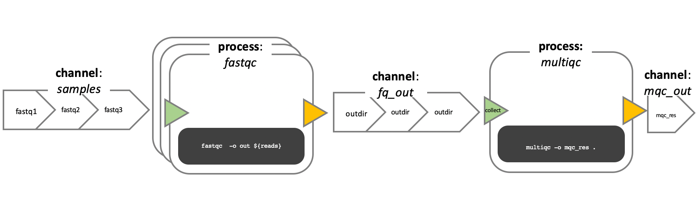
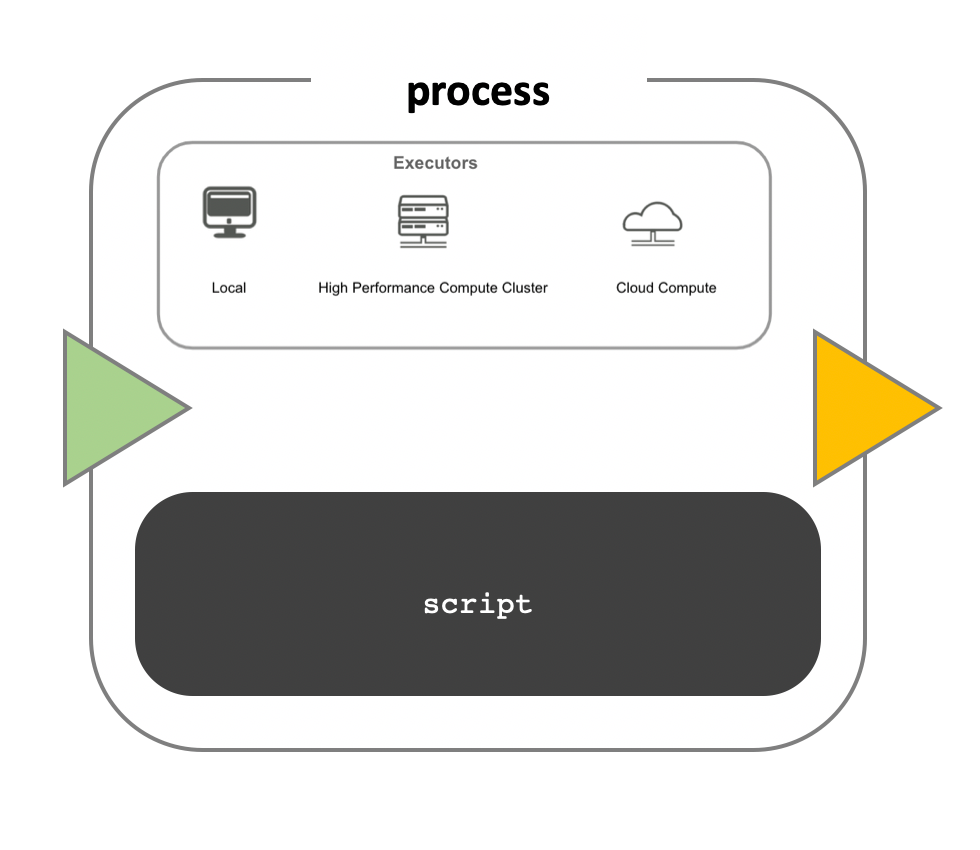

## Workflows

Analysing data involves a sequence of tasks, including gathering, cleaning, and processing data. These sequence of tasks are called a workflow or a pipeline. These workflows typically require executing multiple software packages, sometimes running on different computing environments, such as a desktop or a compute cluster. Traditionally these workflows have been joined together in scripts using general purpose programming languages such as Bash or Python.

 

 
<em>Example bioinformatics variant calling workflow/pipeline diagram from [nf-core](https://nf-co.re/sarek) and simple RNA-Seq pipeline in DAG format.
</em>

 

However, as workflows become larger and more complex, the management of the programming logic and software becomes difficult.

##  Workflow management systems

*Workflow Management Systems* (WfMS), such as Snakemake, Galaxy, and Nextflow have been developed specifically to manage computational data-analysis workflows in fields such as Bioinformatics, Imaging, Physics, and Chemistry.  

WfMS contain multiple features that simplify the development, monitoring, execution and sharing of pipelines.

Key features include;

* **Run time management**: Management of program execution on the operating system and splitting tasks and data to run at the same time in a process called parallelisation.
* **Software management**: Use of technology like containers, such as [Docker](https://www.docker.com) or [Singularity](https://sylabs.io/singularity), that packages up code and all its dependencies so the application runs reliably from one computing environment to another.
* **Portability & Interoperability**: Workflows written on one system can be run on another computing infrastructure e.g., local computer, compute cluster, or cloud infrastructure.
* **Reproducibility**: The use of software management systems and a pipeline specification means that the workflow will produce the same results when re-run, including on different computing platforms.
* **Reentrancy**: Continuous checkpoints allow workflows to resume
from the last successfully executed steps.

## Nextflow basic concepts

Nextflow is a workflow management system that combines a runtime environment, software that is designed to run other software, and a *programming domain specific language (DSL)* that eases the writing of computational pipelines.

Nextflow is built around the idea that Linux is the lingua franca of data science. Nextflow follows Linux's "small pieces loosely joined" philosophy: in which many simple but powerful command-line and scripting tools, when chained together, facilitate more complex data manipulations.

Nextflow extends this approach, adding the ability to define complex program interactions and an accessible (high-level) parallel computational environment based on the [dataflow programming model](https://devopedia.org/dataflow-programming), whereby `processes` are connected via their `outputs` and `inputs` to other `processes`, and run as soon as they receive an input.

The diagram below illustrates the differences between a dataflow model and a simple linear program .

 

 
<em>A simple program (a) and its dataflow equivalent (b) https://doi.org/10.1145/1013208.1013209.
</em>

 

In a simple program **(a)**, these statements would be executed sequentially. Thus, the program would execute in three units of time. In the dataflow programming model **(b)**, this program takes only two units of time. This is because the read quantitation and QC steps have no dependencies on each other and therefore can execute simultaneously in parallel.

### Nextflow core features

1. **Fast prototyping**: A simple syntax for writing pipelines that enables you to reuse existing scripts and tools for fast prototyping.

1. **Reproducibility**: Nextflow supports several container technologies, such as Docker and Singularity, as well as the package manager [Conda](https://docs.conda.io). This, along with the integration of the [GitHub](https://www.github.com) code sharing platform, allows you to write self-contained pipelines, manage versions and to reproduce any former configuration.

1. **Portability**: Nextflow's syntax separates the functional logic (the steps of the workflow) from the execution settings (how the workflow is executed). This allows the pipeline to be run on multiple platforms, e.g. local compute vs. a university compute cluster or a cloud service like AWS, without changing the steps of the workflow.  

1. **Simple parallelism**:  Nextflow is based on the dataflow programming model which greatly simplifies the splitting of tasks that can be run at the same time (parallelisation).

1. **Continuous checkpoints**: All the intermediate results produced during the pipeline execution are automatically tracked. This allows you to resume its execution from the last successfully executed step, no matter what the reason was for it stopping.

### Scripting language

Nextflow scripts are written using a language intended to simplify
the writing of workflows. Languages written for a specific field are called Domain Specific Languages (DSL), e.g., SQL is used to work with databases, and AWK is designed for text processing.

In practical terms the Nextflow scripting language is an extension of the [Groovy programming language](https://groovy-lang.org/), which in turn is a super-set of the Java programming language. Groovy simplifies the writing of code and is more approachable than Java. Groovy semantics (syntax, control structures, etc) are documented [here](https://groovy-lang.org/semantics.html).

The approach of having a simple DSL built on top of a more powerful
general purpose programming language makes Nextflow very flexible. The
Nextflow syntax can handle most workflow use cases with ease, and then
Groovy can be used to handle corner cases which may be difficult to
implement using the DSL.

### DSL2 syntax

Nextflow (version > 20.07.1) provides a revised syntax to the original
DSL, known as DSL2. The DSL2 syntax introduces several improvements
such as modularity (separating components to provide flexibility and
enable reuse), and improved data flow manipulation. This further simplifies the writing of complex data analysis pipelines, and enhances workflow readability, and reusability.

This feature is enabled by the following directive at the beginning a workflow script:

~~~
nextflow.enable.dsl=2
~~~
{: .language-groovy}

> ## Earlier syntax versions
>
> Scripts that contain the directive `nextflow.preview.dsl=2` use an early version of the DSL2 syntax, which may include experimental features that have been changed or removed in the formal DSL2 syntax. Scripts without these directives use the first version of the Nextflow syntax which we refer to as DSL1. DSL1 workflows use many of the same concepts presented in this lesson, but some aspects such as the flow of data are written differently. DSL1 workflows are also written in a single script, unlike DSL2 workflows which can be spread across many files. This lesson will focus on the DSL2 syntax as, after the DSL1 to DSL2 transition period is over, it will become the default way of writing Nextflow workflows.
{: .callout}

### Processes, channels, and workflows

Nextflow workflows have three main parts; processes, channels, and workflows. Processes describe a task to be run. A process script can be written in any scripting language that can be executed by the Linux platform (Bash, Perl, Ruby, Python, etc.). Processes spawn a task for each complete input set. Each task is executed independently, and cannot interact with another task. The only way data can be passed between process tasks is via asynchronous queues, called channels.

Processes define inputs and outputs for a task. Channels are then used to manipulate the flow of data from one process to the next. The interaction between processes, and ultimately the pipeline execution flow itself, is then explicitly defined in a workflow section.

In the following example we have a channel containing three elements, e.g., 3 data files. We have a process that takes the channel as input. Since the channel has three elements, three independent instances (tasks) of that process are run in parallel. Each task generates an output, which is passed to another channel and used as input for the next process.

   
    
   <em>Nextflow process flow diagram</em>

### Workflow execution

While a `process` defines what command or script has to be executed, the `executor` determines how that script is actually run in the target system.

If not otherwise specified, processes are executed on the local computer. The local executor is very useful for pipeline development, testing, and small scale workflows, but for large scale computational pipelines, a High Performance Cluster (HPC) or Cloud platform is often required.

   
    
   <em>Nextflow Executors</em>

Nextflow provides a separation between the pipeline’s functional logic and the underlying execution platform. This makes it possible to write a pipeline once, and then run it on your computer, compute cluster, or the cloud, without modifying the workflow, by defining the target execution platform in a configuration file.

Nextflow provides out-of-the-box support for major batch schedulers and cloud platforms such as Sun Grid Engine, SLURM job scheduler, AWS Batch service and Kubernetes. A full list can be found [here](https://www.nextflow.io/docs/latest/executor.html).

## Your first script

We are now going to look at a sample Nextflow script that counts the number of lines in a file.

Open the file `wc.nf` in the script directory with your favourite text editor.

This is a Nextflow script. It contains;

1. An optional interpreter directive ("Shebang") line, specifying the location of the Nextflow interpreter.
1. `nextflow.enable.dsl=2` to enable DSL2 syntax.
1. A multi-line Nextflow comment, written using C style block comments,
followed by a single line comment.
1. A pipeline parameter `params.input` which is given a default value, of the relative path to the location of a compressed fastq file, as a string.
1. An unnamed `workflow` execution block, which is the default workflow to run.
1. A Nextflow channel used to read in data to the workflow.
1. A call to the process `NUM_LINES`.
1. An operation on the process output, using the channel operator `view()`.
1. A Nextflow `process` block named `NUM_LINES`, which defines what the process does.
1. An `input` definition block that assigns the input to the variable `read`, and declares that it should be interpreted as a file `path`.
1. An `output` definition block that uses the Linux/Unix standard output stream `stdout` from the script block.
1. A `script` block that contains the bash commands ` printf '${read}` to print the name of the read file, and ` gunzip -c ${read} | wc -l` to count the number of lines in the gzipped read file.

~~~
#!/usr/bin/env nextflow

nextflow.enable.dsl=2

/*  Comments are uninterpreted text included with the script.
    They are useful for describing complex parts of the workflow
    or providing useful information such as workflow usage.

    Usage:
       nextflow run wc.nf --input <input_file>

    Multi-line comments start with a slash asterisk /* and finish with an asterisk slash. */
//  Single line comments start with a double slash // and finish on the same line

/*  Workflow parameters are written as params.<parameter>
    and can be initialised using the `=` operator. */
params.input = "data/yeast/reads/ref1_1.fq.gz"

//  The default workflow
workflow {

    //  Input data is received through channels
    input_ch = Channel.fromPath(params.input)

    /*  The script to execute is called by its process name,
        and input is provided between brackets. */
    NUM_LINES(input_ch)

    /*  Process output is accessed using the `out` channel.
        The channel operator view() is used to print
        process output to the terminal. */
    NUM_LINES.out.view()
}

/*  A Nextflow process block
    Process names are written, by convention, in uppercase.
    This convention is used to enhance workflow readability. */
process NUM_LINES {

    input:
    path read

    output:
    stdout

    script:
    /* Triple quote syntax """, Triple-single-quoted strings may span multiple lines. The content of the string can cross line boundaries without the need to split the string in several pieces and without concatenation or newline escape characters. */
    """
    printf '${read} '
    gunzip -c ${read} | wc -l
    """
}
~~~~
{: .language-groovy}

To run a Nextflow script use the command `nextflow run <script_name>`.

> ## Run a Nextflow  script
> Run the script by entering the following command in your terminal:
>
> ~~~
> $ nextflow run wc.nf
> ~~~
> {: .language-bash}
> > ## Solution
> > You should see output similar to the text shown below:
> >
> > ~~~
> > N E X T F L O W  ~  version 20.10.0
> > Launching `wc.nf` [fervent_babbage] - revision: c54a707593
> > executor >  local (1)
> > [21/b259be] process > NUM_LINES (1) [100%] 1 of 1 ✔
> >
> >  ref1_1.fq.gz 58708
> > ~~~
> > {: .output}
> >
> > 1. The first line shows the Nextflow version number.
> > 1. The second line shows the run name `fervent_babbage` (adjective and scientist name) and revision id `c54a707593`.
> > 1. The third line tells you the process has been executed locally (`executor >  local`).
> > 1. The next line shows the process id `21/b259be`, process name, number of cpus, percentage task completion, and how many instances of the process have been run.
> > 1. The final line is the output of the `view` operator.
> {: .solution}
{: .challenge}

> ## Process identification
> The hexadecimal numbers, like 61/1f3ef4, identify the unique process execution.
> These numbers are also the prefix of the directories where each process is executed.
> You can inspect the files produced by changing to the directory `$PWD/work` and
> using these numbers to find the process-specific execution path. We will learn how exactly 
> nextflow using *work* directory to execute processes in the following sections. 
{: .callout}


