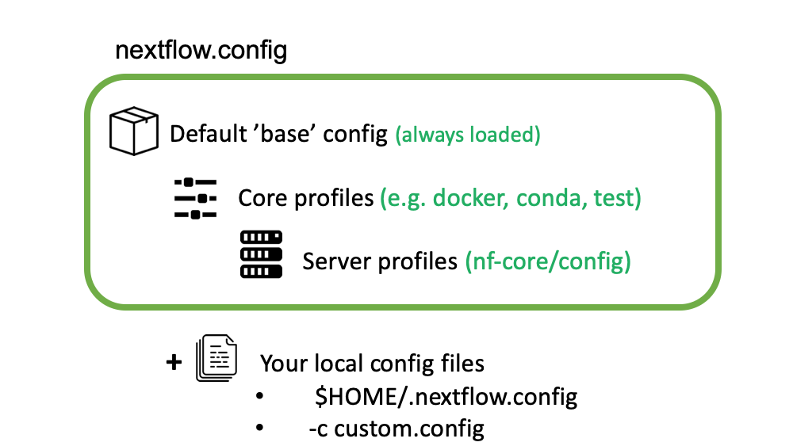

::::::::::::::::::::::::::::::::::::::: objectives

- Understand what nf-core is and how it relates to Nextflow.
- Use the nf-core helper tool to find nf-core pipelines.
- Understand how to configuration nf-core pipelines.
- Run a small nf-core pipeline using a test dataset.

::::::::::::::::::::::::::::::::::::::::::::::::::

:::::::::::::::::::::::::::::::::::::::: questions

- Where can I find best-practice Nextflow bioinformatic pipelines?
- How do I run nf-core pipelines?
- How do I configure nf-core pipelines to use my data?
- How do I reference nf-core pipelines?

::::::::::::::::::::::::::::::::::::::::::::::::::

### What is nf-core?

nf-core is a community-led project to develop a set of best-practice pipelines built using Nextflow workflow management system.
Pipelines are governed by a set of guidelines, enforced by community code reviews and automatic code testing.

{alt='nf-core'}

In this episode we will covering finding, deploying and configuring nf-core pipelines.

### What are nf-core pipelines?

nf-core pipelines are an organised collection of Nextflow scripts,  other non-nextflow scripts (written in any language), configuration files, software specifications, and documentation hosted on [GitHub](https://github.com/nf-core). There is generally a single pipeline for a given data and analysis type e.g. There is a single pipeline for bulk RNA-Seq. All nf-core pipelines are distributed under the, permissive free software, [MIT licences](https://en.wikipedia.org/wiki/MIT_License).

### What is nf-core tools?

nf-core provides a suite of helper tools aim to help people run and develop pipelines.
The [nf-core tools](https://nf-co.re/tools) package is written in Python and can run from the command line or imported and used within other packages.

:::::::::::::::::::::::::::::::::::::::::  callout

### Automatic version check

nf-core/tools automatically checks the web to see if there is a new version of nf-core/tools available. If you would
prefer to skip this check, set the environment variable NFCORE\_NO\_VERSION\_CHECK. For example:

```bash
export NFCORE_NO_VERSION_CHECK=1
```

::::::::::::::::::::::::::::::::::::::::::::::::::

#### nf-core tools sub-commands

You can use the `--help` option to see the range of nf-core tools sub-commands.
In this episode we will be covering the `list`, `launch` and `download` sub-commands which
aid in the finding and deployment of the nf-core pipelines.

```bash
$ nf-core --help
```

```output
                                          ,--./,-.
          ___     __   __   __   ___     /,-._.--~\
    |\ | |__  __ /  ` /  \ |__) |__         }  {
    | \| |       \__, \__/ |  \ |___     \`-._,-`-,
                                          `._,._,'

    nf-core/tools version 2.1


Usage: nf-core [OPTIONS] COMMAND [ARGS]...

Options:
  --version                  Show the version and exit.
  -v, --verbose              Print verbose output to the console.
  -l, --log-file <filename>  Save a verbose log to a file.
  --help                     Show this message and exit.

Commands:
  list          List available nf-core pipelines with local info.
  launch        Launch a pipeline using a web GUI or command line prompts.
  download      Download a pipeline, nf-core/configs and pipeline...
  licences      List software licences for a given workflow.
  create        Create a new pipeline using the nf-core template.
  lint          Check pipeline code against nf-core guidelines.
  modules       Tools to manage Nextflow DSL2 modules as hosted on...
  schema        Suite of tools for developers to manage pipeline schema.
  bump-version  Update nf-core pipeline version number.
  sync          Sync a pipeline TEMPLATE branch with the nf-core template.
```

### Listing available nf-core pipelines

The simplest sub-command is `nf-core list`, which lists all available nf-core pipelines in the nf-core Github repository.

The output shows the latest version number and when that was released.
If the pipeline has been pulled locally using Nextflow, it tells you when that was and whether you have the latest version.

Run the command below.

```bash
$ nf-core list
```

An example of the output from the command is as follows:

```output


                                          ,--./,-.
          ___     __   __   __   ___     /,-._.--~\
    |\ | |__  __ /  ` /  \ |__) |__         }  {
    | \| |       \__, \__/ |  \ |___     \`-._,-`-,
                                          `._,._,'

    nf-core/tools version 2.1


    ┏━━━━━━━━━━━━━━━━━━━┳━━━━━━━┳━━━━━━━━━━━━━━━━┳━━━━━━━━━━━━━━━┳━━━━━━━━━━━━━┳━━━━━━━━━━━━━━━━━━━━━━┓
    ┃ Pipeline Name     ┃ Stars ┃ Latest Release ┃      Released ┃ Last Pulled ┃ Have latest release? ┃
    ┡━━━━━━━━━━━━━━━━━━━╇━━━━━━━╇━━━━━━━━━━━━━━━━╇━━━━━━━━━━━━━━━╇━━━━━━━━━━━━━╇━━━━━━━━━━━━━━━━━━━━━━┩
    │ mhcquant          │    14 │          2.0.0 │    4 days ago │           - │ -                    │
    │ bacass            │    28 │          2.0.0 │   2 weeks ago │           - │ -                    │
    │ viralrecon        │    48 │            2.2 │  1 months ago │           - │ -                    │
    │ rnaseq            │   364 │            3.3 │  1 months ago │           - │ -                    │
    │ mag               │    63 │          2.1.0 │  1 months ago │           - │ -                    │
    │ fetchngs          │    25 │            1.2 │  1 months ago │           - │ -                    │
    │ bcellmagic        │    14 │          2.0.0 │  2 months ago │           - │ -                    │
    │ ampliseq          │    67 │          2.0.0 │  2 months ago │           - │ -                    │
[..truncated..]
```

#### Filtering available nf-core pipelines

If you supply additional keywords after the `list` sub-command, the listed pipeline will be filtered.
**Note:** that this searches more than just the displayed output, including keywords and description text.

Here we filter on the keywords **rna** and **rna-seq** .

```bash
$ nf-core list rna rna-seq
```

```output

                                          ,--./,-.
          ___     __   __   __   ___     /,-._.--~\
    |\ | |__  __ /  ` /  \ |__) |__         }  {
    | \| |       \__, \__/ |  \ |___     \`-._,-`-,
                                          `._,._,'

    nf-core/tools version 2.1


┏━━━━━━━━━━━━━━━┳━━━━━━━┳━━━━━━━━━━━━━━━━┳━━━━━━━━━━━━━━┳━━━━━━━━━━━━━┳━━━━━━━━━━━━━━━━━━━━━━┓
┃ Pipeline Name ┃ Stars ┃ Latest Release ┃     Released ┃ Last Pulled ┃ Have latest release? ┃
┡━━━━━━━━━━━━━━━╇━━━━━━━╇━━━━━━━━━━━━━━━━╇━━━━━━━━━━━━━━╇━━━━━━━━━━━━━╇━━━━━━━━━━━━━━━━━━━━━━┩
│ rnaseq        │   364 │            3.3 │ 1 months ago │           - │ -                    │
│ smrnaseq      │    26 │          1.1.0 │ 3 months ago │           - │ -                    │
│ dualrnaseq    │     4 │          1.0.0 │ 7 months ago │           - │ -                    │
│ rnafusion     │    60 │          1.2.0 │  1 years ago │           - │ -                    │
│ circrna       │     8 │            dev │            - │           - │ -                    │
│ lncpipe       │    22 │            dev │            - │           - │ -                    │
│ scflow        │     6 │            dev │            - │           - │ -                    │
└───────────────┴───────┴────────────────┴──────────────┴─────────────┴──────────────────────┘
```

#### Sorting available nf-core pipelines

You can sort the results by adding the option `--sort` followed by a keyword.
For example, latest release (`--sort release`), when you last pulled a local copy (`--sort pulled`), alphabetically (`--sort name`), or number of GitHub stars (`--sort stars`).

```bash
nf-core list rna rna-seq --sort stars
```

```output
                                      ,--./,-.
      ___     __   __   __   ___     /,-._.--~\
|\ | |__  __ /  ` /  \ |__) |__         }  {
| \| |       \__, \__/ |  \ |___     \`-._,-`-,
                                      `._,._,'

nf-core/tools version 2.1


┏━━━━━━━━━━━━━━━┳━━━━━━━┳━━━━━━━━━━━━━━━━┳━━━━━━━━━━━━━━┳━━━━━━━━━━━━━┳━━━━━━━━━━━━━━━━━━━━━━┓
┃ Pipeline Name ┃ Stars ┃ Latest Release ┃     Released ┃ Last Pulled ┃ Have latest release? ┃
┡━━━━━━━━━━━━━━━╇━━━━━━━╇━━━━━━━━━━━━━━━━╇━━━━━━━━━━━━━━╇━━━━━━━━━━━━━╇━━━━━━━━━━━━━━━━━━━━━━┩
│ rnaseq        │   364 │            3.3 │ 1 months ago │           - │ -                    │
│ rnafusion     │    60 │          1.2.0 │  1 years ago │           - │ -                    │
│ smrnaseq      │    26 │          1.1.0 │ 3 months ago │           - │ -                    │
│ lncpipe       │    22 │            dev │            - │           - │ -                    │
│ circrna       │     8 │            dev │            - │           - │ -                    │
│ scflow        │     6 │            dev │            - │           - │ -                    │
│ dualrnaseq    │     4 │          1.0.0 │ 7 months ago │           - │ -                    │
└───────────────┴───────┴────────────────┴──────────────┴─────────────┴──────────────────────┘
```

:::::::::::::::::::::::::::::::::::::::::  callout

### Archived pipelines

Archived pipelines are not returned by default. To include them, use the `--show_archived` flag.


::::::::::::::::::::::::::::::::::::::::::::::::::

:::::::::::::::::::::::::::::::::::::::  challenge

### Exercise: listing nf-core pipelines

1. Use the `--help` flag to print the list command usage.
2. Sort all pipelines by popularity (stars) and find out which is the most popular?.
3. Filter pipelines for those that work with RNA and find out how many there are?

:::::::::::::::  solution

### Solution

Use the `--help` flag to print the list command usage.

```bash
$ nf-core list --help
```

Sort all pipelines by popularity (stars).

```bash
$ nf-core list --sort stars
```

Filter pipelines for those that work with RNA.

```bash
$ nf-core list rna
```

:::::::::::::::::::::::::

::::::::::::::::::::::::::::::::::::::::::::::::::

### Running nf-core pipelines

#### Software requirements for nf-core pipelines

nf-core pipeline software dependencies are specified using either Docker, Singularity or Conda. It is Nextflow that handles the downloading of containers and creation of conda environments. In theory it is possible to run the pipelines with software installed by other methods (e.g. environment modules, or manual installation), but this is not recommended.

#### Fetching pipeline code

Unless you are actively developing pipeline code, you should use Nextflow's [built-in functionality](https://www.nextflow.io/docs/latest/sharing.html) to fetch nf-core pipelines. You can use the following command to pull the latest version of a remote workflow from the nf-core github site.;

```bash
$ nextflow pull nf-core/<PIPELINE>
```

Nextflow will also automatically fetch the pipeline code when you run

```bash
$ nextflow run nf-core/<pipeline>`.
```

For the best reproducibility, it is good to explicitly reference the pipeline version number that you wish to use with the `-revision`/`-r` flag.

In the example below we are pulling the rnaseq pipeline version 3.0

```bash
$ nextflow pull nf-core/rnaseq -revision 3.0
```

We can check the pipeline has been pulled using the `nf-core list` command.

```bash
nf-core list rnaseq -s pulled
```

We can see from the output we have the latest release.

```output
                                      ,--./,-.
      ___     __   __   __   ___     /,-._.--~\
|\ | |__  __ /  ` /  \ |__) |__         }  {
| \| |       \__, \__/ |  \ |___     \`-._,-`-,
                                      `._,._,'

nf-core/tools version 2.1


┏━━━━━━━━━━━━━━━━━━━┳━━━━━━━┳━━━━━━━━━━━━━━━━┳━━━━━━━━━━━━━━━┳━━━━━━━━━━━━━━━━┳━━━━━━━━━━━━━━━━━━━━━━┓
┃ Pipeline Name     ┃ Stars ┃ Latest Release ┃      Released ┃    Last Pulled ┃ Have latest release? ┃
┡━━━━━━━━━━━━━━━━━━━╇━━━━━━━╇━━━━━━━━━━━━━━━━╇━━━━━━━━━━━━━━━╇━━━━━━━━━━━━━━━━╇━━━━━━━━━━━━━━━━━━━━━━┩
│ rnaseq            │   394 │            3.4 │  4 weeks ago  │ 1 minutes ago  │ Yes (v3.4)           │
[..truncated..]
```

:::::::::::::::::::::::::::::::::::::::::  callout

### Development Releases

If not specified, Nextflow will fetch the default git branch. For pipelines with a stable release this the default branch is `master` - this branch contains code from the latest release. For pipelines in early development that don't have any releases, the default branch is `dev`.


::::::::::::::::::::::::::::::::::::::::::::::::::

:::::::::::::::::::::::::::::::::::::::  challenge

### Exercise: Fetch the latest RNA-Seq pipeline

1. Use the `nextflow pull` command to download the latest `nf-core/rnaseq` pipeline

2. Use the `nf-core list` command to see if you have the latest version of the pipeline

:::::::::::::::  solution

### Solution

Use the `nextflow pull` command to download the latest `nf-core/rnaseq` pipeline

```bash
$ nextflow pull nf-core/rnaseq
```

Use the `nf-core list` command to see if you have the latest version of the pipeline

```bash
$ nf-core list rnaseq --sort pulled
```

:::::::::::::::::::::::::

::::::::::::::::::::::::::::::::::::::::::::::::::

## Usage instructions and documentation

You can find general documentation and instructions for Nextflow and nf-core on the [nf-core website](https://nf-co.re/) .
Pipeline-specific documentation is bundled with each pipeline in the /docs folder. This can be read either locally, on GitHub, or on the nf-core website.

Each pipeline has its own webpage at [https://nf-co.re/](https://nf-co.re/)\<pipeline\_name> e.g. [nf-co.re/rnaseq](https://nf-co.re/rnaseq/usage)

In addition to this documentation, each pipeline comes with basic command line reference. This can be seen by running the pipeline with the parameter `--help` , for example:

```bash
$ nextflow run -r 3.4 nf-core/rnaseq --help
```

```output
N E X T F L O W  ~  version 20.10.0
Launching `nf-core/rnaseq` [silly_miescher] - revision: 964425e3fd [3.4]
------------------------------------------------------
                                        ,--./,-.
        ___     __   __   __   ___     /,-._.--~'
  |\ | |__  __ /  ` /  \ |__) |__         }  {
  | \| |       \__, \__/ |  \ |___     \`-._,-`-,
                                        `._,._,'
  nf-core/rnaseq v3.0
------------------------------------------------------

Typical pipeline command:

    nextflow run nf-core/rnaseq --input samplesheet.csv --genome GRCh37 -profile docker

Input/output options
    --input                             [string]  Path to comma-separated file containing information about the samples in the experiment.
    --outdir                            [string]  Path to the output directory where the results will be saved.
    --public_data_ids                   [string]  File containing SRA/ENA/GEO identifiers one per line in order to download their associated FastQ files.
    --email                             [string]  Email address for completion summary.
    --multiqc_title                     [string]  MultiQC report title. Printed as page header, used for filename if not otherwise specified.
    --skip_sra_fastq_download           [boolean] Only download metadata for public data database ids and don't download the FastQ files.
    --save_merged_fastq                 [boolean] Save FastQ files after merging re-sequenced libraries in the results directory.
..truncated..
```

### The nf-core launch command

As can be seen from the output of the help option nf-core pipelines have a number of flags that need to be passed on the command line: some mandatory, some optional.

To make it easier to launch pipelines, these parameters are described in a JSON file, `nextflow_schema.json` bundled with the pipeline.

The `nf-core launch` command uses this to build an interactive command-line wizard which walks through the different options with descriptions of each, showing the default value and prompting for values.

Once all prompts have been answered, non-default values are saved to a `params.json` file which can be supplied to Nextflow  using the `-params-file` option. Optionally, the Nextflow command can be launched there and then.

To use the launch feature, just specify the pipeline name:

```bash
$ nf-core launch -r 3.0 rnaseq
```

:::::::::::::::::::::::::::::::::::::::  challenge

### Exercise : Create nf-core params file

Use the `nf-core launch` command to create a params file named `nf-params.json`.

1. Use the `nf-core launch` command to launch the interactive command-line wizard.
2. Add an input file name `samples.csv`
3. Add a genome `GRCh38`
  \*\* Note \*\* : Do not run the command now.

:::::::::::::::  solution

### Solution

```bash
$ nf-core launch rnaseq
```

The contents of the `nf-params.json` file should be

```
{
  "input": "samples.csv",
  "genome": "GRCh38"
}
```

:::::::::::::::::::::::::

::::::::::::::::::::::::::::::::::::::::::::::::::

### Config files

nf-core pipelines make use of Nextflow's configuration files to specify how the pipelines runs, define custom parameters and what software management system to use e.g. docker, singularity or conda.

Nextflow can load pipeline configurations from multiple locations.  nf-core pipelines load configuration in the following order:

{alt='config'}

1. Pipeline: Default 'base' config

- Always loaded. Contains pipeline-specific parameters and "sensible defaults" for things like computational requirements
- Does not specify any method for software packaging. If nothing else is specified, Nextflow will expect all software to be available on the command line.

2. Core config profiles

- All nf-core pipelines come with some generic config profiles. The most commonly used ones are for software packaging: docker, singularity and conda
- Other core profiles are debug and two test profiles. There two test profile, a small test profile (nf-core/test-datasets) for quick test and a full test profile which provides the path to full sized data from public repositories.

3. Server profiles

- At run time, nf-core pipelines fetch configuration profiles from the [configs remote repository](https://github.com/nf-core/configs). The profiles here are specific to clusters at different institutions.
- Because this is loaded at run time, anyone can add a profile here for their system and it will be immediately available for all nf-core pipelines.

4. Local config files given to Nextflow with the `-c` flag

```bash
$ nextflow run nf-core/rnaseq -r 3.0 -c mylocal.config
```

5\. Command line configuration: pipeline parameters can be passed on the command line using the `--<parameter>` syntax.

```bash
$ nextflow run nf-core/rnaseq -r 3.0 --email "my@email.com"`
```

#### Config Profiles

nf-core makes use of Nextflow configuration `profiles` to make it easy to apply a group of options on the command line.

Configuration files can contain the definition of one or more profiles. A profile is a set of configuration attributes that can be activated/chosen when launching a pipeline execution by using the `-profile` command line option. Common profiles are `conda`, `singularity` and `docker` that specify which software manager to use.

Multiple profiles are comma-separated. When there are differing configuration settings provided by different profiles, the right-most profile takes priority.

```bash
$ nextflow run nf-core/rnaseq -r 3.0 -profile test,conda
$ nextflow run nf-core/rnaseq -r 3.0 -profile <institutional_config_profile>, test, conda
```

**Note** The order in which config profiles are specified matters. Their priority increases from left to right.

:::::::::::::::::::::::::::::::::::::::::  callout

### Multiple Nextflow configuration locations

Be clever with multiple Nextflow configuration locations. For example, use `-profile` for your cluster  configuration, the file `$HOME/.nextflow/config` for your personal config such as `params.email` and a working directory >`nextflow.config` file for reproducible run-specific configuration.


::::::::::::::::::::::::::::::::::::::::::::::::::

:::::::::::::::::::::::::::::::::::::::  challenge

### Exercise  create a custom config

Add the `params.email` to a file called `nfcore-custom.config`

:::::::::::::::  solution

### Solution

A line similar to one below in the file custom.config

```
params.email = "myemail@address.com"
```

:::::::::::::::::::::::::

::::::::::::::::::::::::::::::::::::::::::::::::::

## Running pipelines with test data

The nf-core config profile `test` is special profile, which defines a minimal data set and configuration, that runs quickly and tests the workflow from beginning to end. Since the data is minimal, the output is often nonsense. Real world  example output are instead linked on the nf-core pipeline web page, where the workflow has been run with a full size data set:

```bash
$ nextflow run nf-core/<pipeline_name> -profile test
```

:::::::::::::::::::::::::::::::::::::::::  callout

### Software configuration profile

Note that you will typically still need to combine this with a software configuration profile for your system - e.g.
`-profile test,conda`.
Running with the test profile is a great way to confirm that you have Nextflow configured properly for your system before attempting to run with real data


::::::::::::::::::::::::::::::::::::::::::::::::::

### Using nf-core pipelines offline

Many of the techniques and resources described above require an active internet connection at run time - pipeline files, configuration profiles and software containers are all dynamically fetched when the pipeline is launched. This can be a problem for people using secure computing resources that do not have connections to the internet.

To help with this, the `nf-core download` command automates the fetching of required files for running nf-core pipelines offline.
The command can download a specific release of a pipeline with `-r`/`--release` .  
By default, the pipeline will download the pipeline code and the institutional nf-core/configs files.

If you specify the flag `--singularity`, it will also download any singularity image files that are required (this needs Singularity to be installed). All files are saved to a single directory, ready to be transferred to the cluster where the pipeline will be executed.

```
$ nf-core download nf-core/rnaseq -r 3.4
```

> 
```bash

                                          ,--./,-.
          ___     __   __   __   ___     /,-._.--~\
    |\ | |__  __ /  ` /  \ |__) |__         }  {
    | \| |       \__, \__/ |  \ |___     \`-._,-`-,
                                          `._,._,'

    nf-core/tools version 2.1


INFO     Saving nf-core/rnaseq                                                                                                                                                                                                                                         download.py:148
          Pipeline release: '3.4'
          Pull singularity containers: 'No'
          Output file: 'nf-core-rnaseq-3.4.tar.gz'
INFO     Downloading workflow files from GitHub                                                                                                                                                                                                                        download.py:151
INFO     Downloading centralised configs from GitHub                                                                                                                                                                                                                   download.py:155
INFO     Compressing download..                                                                                                                                                                                                                                        download.py:166
INFO     Command to extract files: tar -xzf nf-core-rnaseq-3.4.tar.gz                                                                                                                                                                                                  download.py:653
INFO     MD5 checksum for nf-core-rnaseq-3.4.tar.gz: f0e0c239bdb39c613d6a080f1dee88e9
```

:::::::::::::::::::::::::::::::::::::::  challenge

### Exercise  Run a test nf-core pipeline

Run the nf-core/hlatyping pipeline release 1.2.0  with the provided test data using the profile `test` and `conda`.
Add the parameter `--max_memory 3G` on the command line.
Include the config file, `nfcore-custom.config`, from the previous exercise using the option `-c`, to send an email when your pipeline finishes.

```
$ nextflow run nf-core/hlatyping -r 1.2.0 -profile test,conda  --max_memory 3G -c nfcore-custom.config
```

The pipeline does next-generation sequencing-based Human Leukozyte Antigen (HLA) typing and should run quickly.

:::::::::::::::  solution

### Solution

```
$ nextflow run nf-core/hlatyping -r 1.2.0 -profile test,conda  --max_memory 3G
```

```output
 N E X T F L O W  ~  version 21.04.0
Launching `nf-core/hlatyping` [pedantic_engelbart] - revision: 6998794795 [1.2.0]
BAM file format detected. Initiate remapping to HLA alleles with yara mapper.
----------------------------------------------------
                                       ,--./,-.
       ___     __   __   __   ___     /,-._.--~'
 |\ | |__  __ /  ` /  \ |__) |__         }  {
 | \| |       \__, \__/ |  \ |___     \`-._,-`-,
                                       `._,._,'
nf-core/hlatyping v1.2.0
----------------------------------------------------

Pipeline Release  : 1.2.0
Run Name          : pedantic_engelbart
File Type         : BAM
Seq Type          : dna
Index Location    : /home/training/.nextflow/assets/nf-core/hlatyping/data/indices/yara/hla_reference_dna
IP Solver         : glpk
Enumerations      : 1
Beta              : 0.009
Max Memory        : 3G
Max CPUs          : 2
Max Time          : 2d
Input             : https://github.com/nf-core/test-datasets/raw/hlatyping/bam/example_pe.bam
Data Type         : Paired-End
Output Dir        : results
Launch Dir        : /home/training
Working Dir       : /home/training/work
Script Dir        : /home/training/.nextflow/assets/nf-core/hlatyping
User              : training
Max Resources     : 3G memory, 2 cpus, 2d time per job
Config Profile    : conda,test
Config Profile Description: Minimal test dataset to check pipeline function
Config Files      : /home/training/.nextflow/assets/nf-core/hlatyping/nextflow.config, /home/training/nextflow.config, /home/training/.nextflow/assets/nf-> > > >core/hlatyping/nextflow.config
----------------------------------------------------
BAM file format detected. Initiate remapping to HLA alleles with yara mapper.
[-        ] process > remap_to_hla          -
executor >  local (6)
[05/084b41] process > remap_to_hla (1)      [100%] 1 of 1 ✔
[5a/9bec8b] process > make_ot_config        [100%] 1 of 1 ✔
[54/8bc5d7] process > run_optitype (1)      [100%] 1 of 1 ✔
[a9/2cbea8] process > output_documentation  [100%] 1 of 1 ✔
[df/d3dac5] process > get_software_versions [100%] 1 of 1 ✔
[e1/903ed9] process > multiqc (1)           [100%] 1 of 1 ✔
-[nf-core/hlatyping] Pipeline completed successfully-
WARN: To render the execution DAG in the required format it is required to install Graphviz -- See http://www.graphviz.org for more info.
Completed at: 26-Oct-2021 10:07:27
Duration    : 4m 14s
CPU hours   : (a few seconds)
Succeeded   : 6
```

:::::::::::::::::::::::::

::::::::::::::::::::::::::::::::::::::::::::::::::

### Troubleshooting

If you run into issues running your pipeline you can you the nf-core  website  to troubleshoot common mistakes and issues [https://nf-co.re/usage/troubleshooting](https://nf-co.re/usage/troubleshooting) .

#### Extra resources and getting help

If you still have an issue with running the pipeline then feel free to contact the nf-core community via the Slack channel .
The nf-core Slack organisation has channels dedicated for each pipeline, as well as specific topics (eg. `#help`, `#pipelines`, `#tools`, `#configs` and much more).
The nf-core Slack can be found at [https://nfcore.slack.com](https://nfcore.slack.com) (NB: no hyphen in nfcore!). To join you will need an invite, which you can get at [https://nf-co.re/join/slack](https://nf-co.re/join/slack).

You can also get help by opening an issue in the respective pipeline repository on GitHub asking for help.

If you have problems that are directly related to Nextflow and not our pipelines or the nf-core framework tools then check out the [Nextflow gitter channel](https://gitter.im/nextflow-io/nextflow) or the [google group](https://groups.google.com/forum/#!forum/nextflow).

### Referencing a Pipeline

#### Publications

If you use an nf-core pipeline in your work you should cite the main publication for the main nf-core paper, describing the community and framework,
as follows:

> **The nf-core framework for community-curated bioinformatics pipelines.**
> Philip Ewels, Alexander Peltzer, Sven Fillinger, Harshil Patel, Johannes Alneberg, Andreas Wilm, Maxime Ulysse Garcia, Paolo Di Tommaso \& Sven Nahnsen.
> Nat Biotechnol. 2020 Feb 13. doi: [10\.1038/s41587-020-0439-x](https://dx.doi.org/10.1038/s41587-020-0439-x). ReadCube: [Full Access Link](https://rdcu.be/b1GjZ)

Many of the pipelines have a publication listed on the nf-core website that can be found [here](https://nf-co.re/publications).

#### DOIs

In addition, each release of an nf-core pipeline has a digital object identifiers (DOIs) for easy referencing in literature
The DOIs are generated by Zenodo from the pipeline's github repository.


:::::::::::::::::::::::::::::::::::::::: keypoints

- nf-core is a community-led project to develop a set of best-practice pipelines built using the Nextflow workflow management system.
- The nf-core tool (`nf-core`) is a suite of helper tools that aims to help people run and develop nf-core pipelines.
- nf-core pipelines can be found using `nf-core list`, or by checking the nf-core website.
- `nf-core launch nf-core/<pipeline>` can be used to write a parameter file for an nf-core pipeline. This can be supplied to the pipeline using the `-params-file` option.
- An nf-core workflow is run using `nextflow run nf-core/<pipeline>` syntax.
- nf-core pipelines can be reconfigured by using custom config files and/or adding command line parameters.

::::::::::::::::::::::::::::::::::::::::::::::::::


